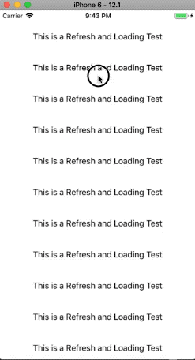
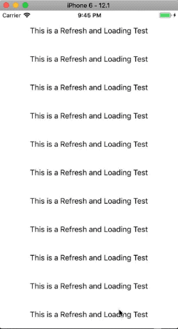
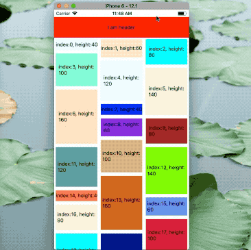

<!--
 * @Author: 石破天惊
 * @email: shanshang130@gmail.com
 * @Date: 2021-07-21 13:11:34
 * @LastEditTime: 2021-07-28 16:35:35
 * @LastEditors: 石破天惊
 * @Description: 
-->
# react-native-largelist

**React-native-largelist** is a very high performance large list component for React-Native. (iOS & Android)
## Features

* Large data source list component, items reused by group, Less CPU/Memory usage. Never blanks.
* Fully Cross-platform bounces (iOS & Android).
* Highly customize Refreshing and Loading. Fully support `react-native-lottie`. More smoothly animation.
* Big media optimization. (New)
* Nested support. (New)
* Paging enabled. (New)

## Preview





## Installation

```
yarn add react-native-spring-scrollview react-native-largelist

```
RN 0.50-59 without pod
```
react-native link react-native-spring-scrollview
```

RN 0.60+ with pod
```
npx pod-install
```

## Documentation

API reference and more:  [Documentation Reference](https://bolan9999.github.io/react-native-largelist/)

## License

react-native-largelist is released under the MIT license. View LICENSE for details.


