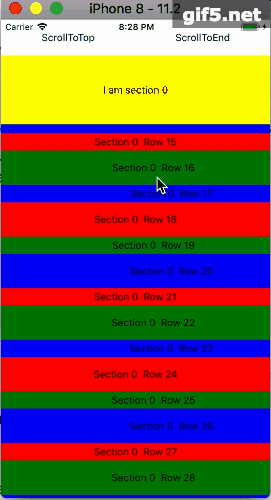
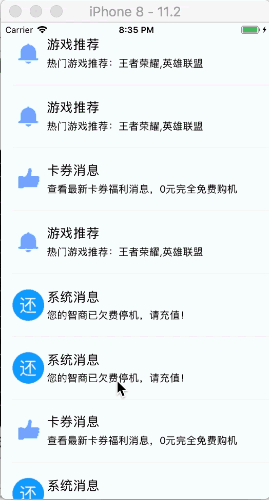
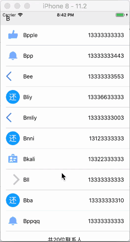
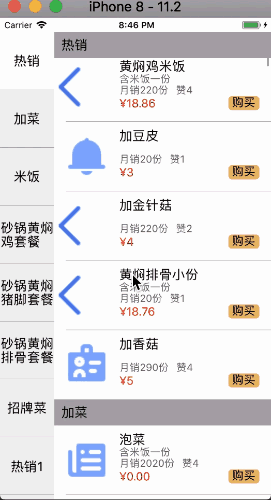
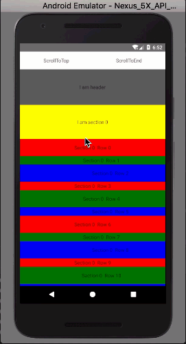
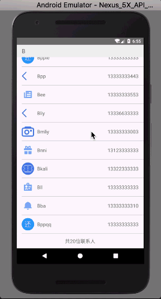
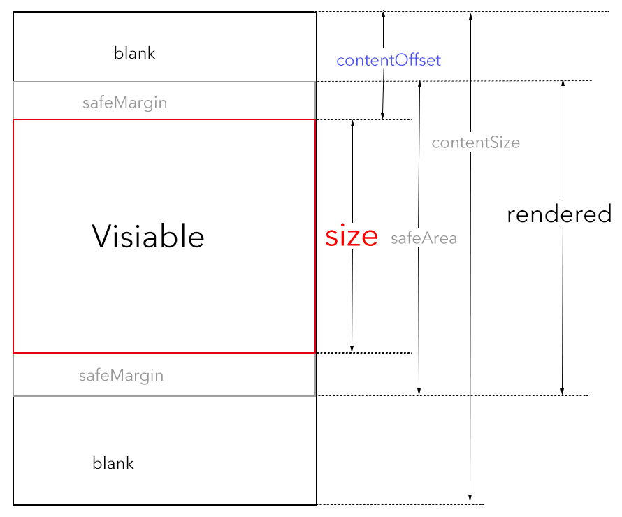

# react-native-largelist

中文文档请 [点击这里](./README-cn.md)

**React-native-largelist** is a high performance large list component for React-Native. It's performance is much better than SectionList.(iOS & Android).

## Features

* The performance of react-native-largelist is much better than FlatList and SectionList.And lower CPU/Memory usage.
* Large data source supported, infinite data supported, super fast sliding support.
* Full cross-platform，Optimize from ScrollView, better version compatibility.
* Sticky Section support.
* Callback when Cell/Item enter/leave the safeArea support.
* List header/footer/empty support.
* Swipe out to edit Cell.
* Pull to Refresh and Scroll loading more.
* Scroll loading more custom view support, all data source load completed custom view support.
* Dynamic variable support, for example: size, contentOffset, currentSection, contentSize, height of Header/Footer, visibleIndexPaths and so on.
* Scroll to offset or index path.
* Reload data.
* Custom optimize parameters.
* More callbacks or dynamic variable can be added through a new issue.

## Preview










## Performance Show
View the video of react-native-largelist performance on [youtube](https://youtu.be/k95G3_QGYHE) or [youku](http://v.youku.com/v_show/id_XMzI0ODc4ODkyOA==.html)

## Getting Started

* Make sure your project is react-native project.
* Using this command to install:

```
npm install react-native-largelist --save
```

* Using it like this:

```
import { LargeList } from "react-native-largelist";

//other code
...
<LargeList
  style={{ flex: 1 }}
  bounces={true}
  refreshing={this.state.refreshing}
  onRefresh={() => {
    this.setState({ refreshing: true });
    setTimeout(() => this.setState({ refreshing: false }), 2000);
  }}
  safeMargin={600}
  numberOfRowsInSection={section => this.props.numberOfEachSection}
  numberOfSections={()=>this.props.numberOfSections}
  heightForCell={(section, row) => row % 2 ? this.minCellHeight : this.maxCellHeight}
  renderCell={this.renderItem.bind(this)}
  heightForSection={section =>section % 2 ? this.minSectionHeight : this.maxSectionHeight}
  renderHeader={this.renderHeader.bind(this)}
  renderFooter={this.renderFooter.bind(this)}
  renderSection={section => {
    return (
      <View
        style={{
          flex: 1,
          backgroundColor: section % 2 ? "grey" : "yellow",
          justifyContent: "center",
          alignItems: "center"
        }}
      >
        <Text>
           I am section {section}
        </Text>
      </View>
    );
  }}
/>
...
```

## Usage

```
import { LargeList } from "react-native-largelist"
```

Props:

Props  |  type  |  default  |  effect  
------ | ------ | --------- | --------
（ViewProps） | （ViewPropTypes） |  | All props of View
numberOfSections | ()=>number | ()=>1 | number of sections in tableview
numberOfRowsInSection | (section:number) => number | section=>0 | function：return the number of rows in section
renderCell | (section:number,row:number) => React.Element | required | function: render of cell with section and row index.The parent is fixed,you can use flex=1
heightForCell | (section:number,row:number) => number | required | function：return height for cell with section and row index 
renderSection | (section:number) => React.Element | section=>null | function：render of section with section index.The parent is fixed,you can use flex=1
heightForSection | (section:number) => number | ()=>0 | function：return height of section with section index
renderHeader | () => React.Element | ()=>null | function：render of header in LargeList. it must have a bounded height in order to work
renderFooter | () => React.Element | ()=>null | function：render of footer in LargeList. it must have a bounded height in order to work
bounces | boolean | true | bounces
refreshing | boolean | undefined | refreshing
onRefresh | () => any | undefined | callback of pulling to refresh,if not undefined ,a default RefreshControl is add to LargeList
onScroll | ({nativeEvent:{contentOffset:{x:number,y:number}}})=> any |  | Callback when scrolling.

Notice:

* If your data source change and it affects the number of sections or the number of cells in section, or the height of any sections or cells, you must call [reloadData](#reloaddata)

## Principle
Before we learn advanced usage, we must first understand the basic principles:

Every Cell/Item is reused just like UITableView/RecyclerView. The top Cell/Item which is Slided to the outside of the visible region does not need to show. So, I move it bottom, render it with the new datasource.

But,as you know, It is different with native UITableView/RecyclerView. They are not one thread between Main Thread(UI Thread) and JavaScript Thread. And They are asynchronous, and the communication between them may take not a few time. So, I try to render more Cells/Items at the upper and lower ends of the visual area. I call it safeArea. And I use it to buffer, to avoid the user slide suddenly and the visual view of the upper and lower edges is flickering.

Look up the design of react-native-largelist:



## Advanced Usage
### safeMargin
* type: number
* default: 600
* The height of rendering children out side of visible area. The greater the value is, the less easily you see the blank in the fast sliding process, but the longer the first time it is loaded

### dynamicMargin
* type: number
* default: 500
* The height of dynamic safe margin when sliding too fast. For example, if safeMargin=600 and dynamicMargin=500, it will render 100 height on top and 1100 height on bottom out side of the visible area when sliding down too fast.

Notice: 

1. It does not work when the speed of sliding is slow.
2. It can not be set larger than safeMargin


### scrollEventThrottle
* type: number
* default: ios:16
* It is the same as scrollEventThrottle on ScrollView

### onIndexPathDidEnterSafeArea
* type: (indexPath:IndexPath)=>any
* default: ()=>null
* The callback when an indexpath did enter safeArea.

### onIndexPathDidLeaveSafeArea
* type: (indexPath:IndexPath)=>any
* default: ()=>null
* The callback when an indexpath did leave safeArea.

### showsVerticalScrollIndicator
* type: bool
* default: true
* Show vertical scroll indicator.

### onSectionDidHangOnTop
* type: section=>any
* default: ()=>null
* The callback when a new Section hang on the top of the LargeList.

### speedLevel1
* type: number
* default: 4
* If the speed of scrolling is faster than speedLevel1, LargeList will not rerender, just use "setNativeProps" to move the position. Unit is    logic pixels/ms.

### speedLevel2
* type: number
* default: 10
* It does not work for the current version.

### nativeOptimize
* type: bool
* default: false
* Use native optimize, iOS only. This is an experimental prop.If it is set, safeArea doesn't make sense. To use the prop, you should add "${YourProject}/node_modules/react-native-largelist/ios/STTVTableView.xcodeproj" to your iOS project. And make sure link it.

### onLoadMore
* type: ()=>any
* default: null
* The callback when pull up on the bottom

### heightForLoadMore
* type: ()=>number
* default: ()=>70
* function: return the height of Loading More View.

### allLoadCompleted
* type: bool
* default: false
* Did all data source load completed?

### renderLoadingMore
* type: ()=>React.Element
* default: ()=> < ActivityIndicator style={{ marginTop: 10, alignSelf: "center" }} size={"large"}/ >
* The render of custom Loading More View,The parent is fixed,you can use flex=1

### renderLoadCompleted
* type: ()=>React.Element
* default: ()=> < Text style={{ marginTop: 20, alignSelf: "center", fontSize: 16 }}>No more data< /Text >
* The render of custom Loading Completed View.The parent is fixed,you can use flex=1

### numberOfCellPoolSize
* type: number
* default: (ScreenHeight + 2 * SafeMargin)/minCellHeight+0.5
* Max size of Cell pool

Notice：

1. LargeList does not create cell when sliding, they are reused.

2. If numberOfCellPoolSize is too large, it takes more time when initialing and reloadData.

3. If it is too small, LargeList will not work  well.

### numberOfSectionPoolSize
* type: number
* default: 6
* Max size of Section pool, Refer to numberOfCellPoolSize as a matter of attention.

### renderEmpty
* type: ()=>React.Element
* default: ()=>null
* The empty view render

Notice：

1. It must have a bounded height in order to work
2. It is empty when numberOfSections===0 || (numberOfSections===1 && numberOfRowsInSection===0)

### widthForRightWhenSwipeOut
* type: (section,row)=>number
* default: ()=>0
* Swipe left, the width of right View. To swipe out to delete/config cell, you must set this prop.

### renderRightWhenSwipeOut
* type: (section,row)=>React.Element
* default: ()=>null
* Swipe left, the render of right View. To swipe out to delete/config cell, you must set this prop.

### widthForLeftWhenSwipeOut
* type: (section,row)=>number
* default: ()=>0
* Swipe right, the width of left View. To swipe out to config cell, you can set this prop.

### renderLeftWhenSwipeOut
* type: (section,row)=>number
* default: ()=>null
* Swipe right, the render of left View. To swipe out to config cell, you can set this prop.

Notice: It is not recommended to use widthForLeftWhenSwipeOut and renderLeftWhenSwipeOut, it will shake sometimes when rotating screen.

### colorForSwipeOutBgColor
* type: (section,row)=>Color
* default: ()=>"#AAA"
* Background color for swipe out.

### initialOffsetY
* type: number
* default: 0
* Initial offset. It works only on init.

### renderItemSeparator
* type: (section,row)=>React.Element
* default: ()=>< View style={{height:1,backgroundColor:"#EEE",marginLeft: 16}} / >
* The render of item separator. It will not work on the last cell of any sections.And notice that the heightForCell contains its height.

### onLargeListDidUpdate
* type: ()=>any
* default: ()=>null
* Callback when LargeList render completed and reloadData completed.

## Method
### scrollTo(offset:Offset, animated:boolean=true)
Scroll to offset.
### scrollToIndexPath(indexPath:IndexPath, animated:boolean = true)
Scroll to an indexpath.
### scrollToEnd(animated:boolean=true)
Scroll to the end of the LargeList.
### visibleIndexPaths():IndexPath[]
Get the visible indexpaths at this time.
### renderedIndexPaths():IndexPath[]
Get the rendered indexpaths at this time.
### freeCount(): number
Get the count of free views at this time.
### reloadIndexPath(indexPath: IndexPath)
Reload datasource on indexpath partially.
### reloadIndexPaths(indexPaths: IndexPath[])
Reload datasource in some indexpaths partially.
### reloadAll()
Reload all datasource partially.

Notice:

1. reloadIndexPath, reloadIndexPaths, reloadAll work partially. They do not work well when the numberOfSections ,numberOfRowsInSection,heightForSection,heightForCell change.Use reloadData instead.

### reloadData()
Reload all datasource globally.

Notice:

1. If the numberOfSections ,numberOfRowsInSection,heightForSection,heightForCell change, you must use this method to reload.
2. Do not use this method often, because it is bad performance.

## Dynamic variable
### size:Size
Current size of LargeList.   Size：{width:number,height:number}
### contentOffset:Offset
Current contentOffset of LargeList.   Offset：{x:number,y:number}
### safeArea: Range
Current safeArea of LargeList..   Range:{top:number,bottom:number}
### topIndexPath: IndexPath
Current topIndexPath of LargeList.   IndexPath:{section:number,row:number}
### bottomIndexPath: IndexPath
Current bottomIndexPath of LargeList.   IndexPath:{section:number,row:number}
### contentSize:Size
Current contentSize of LargeList.   Size:{width:number, height:number}
### currentSection:number
Current section index of LargeList.
### headerHeight:number
Get LargeList's header height
### footerHeight:number
Get LargeList's footer height

## Goals and plans
* Fix bug
* Code optimization， support typescript.

## Update Log

### Version 1.2.5
* Fix section error when reloadData

### Version 1.2.4
* Fix default numberOfCellPoolSize error when empty.

### Version 1.2.3
* Fix typescript type define.

### Version 1.2.2
* Fix bug on onLargeListDidUpdate
* Support TypeScript

### Version 1.2.1
* Fix bug when swipe out.

### Version 1.2.0
* Add swiping left and right to edit cell
* Add empty view
* Fix bug on reloadData when changing the height of header or footer.
* Fix bug when refreshing on Android
* Add initialOffsetY,renderItemSeparator,numberOfCellPoolSize,numberOfSectionPoolSize and onLargeListDidUpdate, reread the docs to learn more.

### Version 1.1.0
* Add loading more
* Fix bug when reload data
* Fix bug on "scrollTo" when animated == false
* Change "visiableIndexPaths" to "visibleIndexPaths", "visiableIndexPaths" will not support after 2.0.0
* Change the type of "numberOfSections" from number to function, number will not support after 2.0.0

### Version 1.0.0
* release


## License

react-native-largelist is released under the MIT license. See LICENSE for details.

