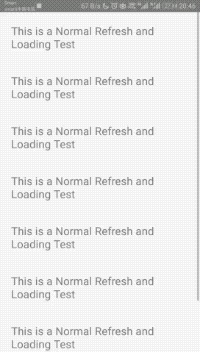

# Pull To Refresh

### Preview



### Code

Import

```$js
import { LargeList } from "react-native-largelist-v2";
import { NormalHeader } from "react-native-spring-scrollview/NormalHeader";
```

It is easy to pull to refresh, (https://bolan9999.github.io/react-native-spring-scrollview) is a dependence of this component. It provide `NormalHeader` to you to implement pull-down to refresh easily.

```$js
<LargeList
    ref={ref => (this._largeList = ref)}
    style={styles.container}
    data={this.state.data}
    heightForSection={() => 40}
    renderSection={this._renderSection}
    heightForIndexPath={() => 60}
    renderIndexPath={this._renderItem}
    refreshHeaderHeight={60}
    refreshHeader={NormalHeader}
    onRefresh={this._onRefresh}
    loadingFooterHeight={60}
    loadingFooter={NormalFooter}
    onLoading={this._onLoading}
    allLoaded={this.state.allLoaded}
    renderHeader={this._renderHeader}
    renderFooter={this._renderFooter}
/>

//...
_onRefresh = () => {
    this._largeList.beginRefresh();
    setTimeout(() => {
        this._largeList.endRefresh();
        this._index = 0;
        this.setState({
            data: [contacts[this._index]],
            allLoaded: this._index > 2
        });
    }, 2000);
};

//...
_onLoading = () => {
    this._largeList.beginLoading();
    setTimeout(() => {
        this._largeList.endLoading();
        this.setState(p => ({
        data: p.data.concat(contacts[++this._index]),
        allLoaded: this._index > 2
        }));
    }, 2000);
};
```


### Props

#### refreshHeaderHeight

Type：number

Default： 80

Effect：The height of refresh component.

#### refreshHeader

Type：RefreshHeader

Default： undefined

Effect：You can use NormalHeader directly to implement pull-down to refresh quickly.
[Customize Refreshing](CustomRefresh) is here

#### onRefresh

Type：()=>any

Default：()=>null

Effect：The call back of Refresh

#### onCancelRefresh

Type：()=>any

Default：()=>null

Effect：The call back of canceling refreshing

### Method

#### beginRefresh()

Begin to refresh, it will pop refresh component.

### endRefresh()

End refreshing. Call endRefresh first, and then update your component is a better way.

