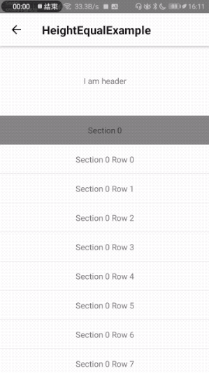
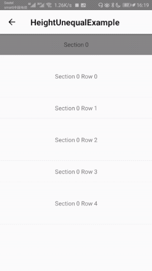
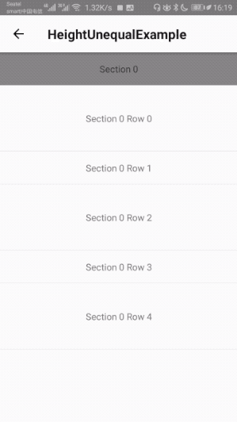
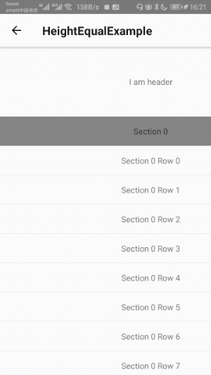
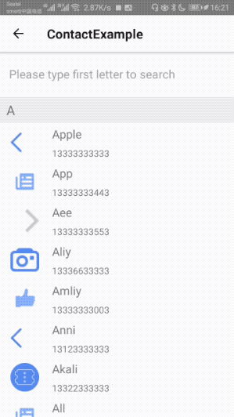
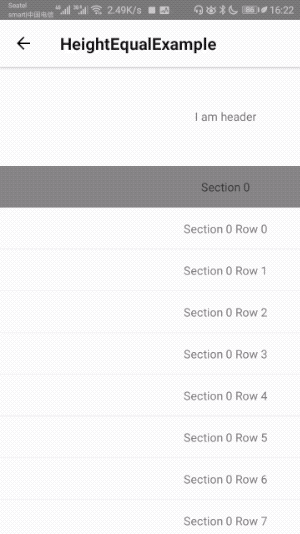
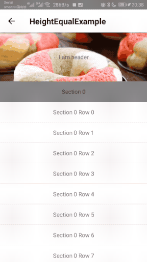

<!--
 * @Author: 石破天惊
 * @email: shanshang130@gmail.com
 * @Date: 2021-07-29 18:09:43
 * @LastEditTime: 2021-07-29 18:22:48
 * @LastEditors: 石破天惊
 * @Description: 
-->
# **React Native Large List V3**
**React Native Large List V3** is the best large list component（iOS & Android）。Its items are all reused, and it is highly performance.

### Features

* Support large data source, highly reused, high performance.Less CPU/Memory usage.
* Cross-platform bounces.（iOS & Android）
* Highly customize Refreshing and Loading.Fully support `react-native-lottie`. More smoothly animation.
* Support header and footer.
* Native onScroll Listener supported.
* Sticky headers supported.
* Support inverted.
* Never blanks.
* Support pagingEnabled (New)
* Big picture or video optimization (New)

### What's updated in V3.1
* SpringScrollView bug fix on android
* Support pagingEnabled
* Big picture or video optimization
* Support beginRefresh
* `renderHeader`,`renderIndexPath` Updated. 

### LargeList

All the features below are supported on both iOS and Android.

##### Sticky section support

&nbsp;&nbsp;&nbsp;&nbsp;&nbsp;&nbsp;

##### Fully Cross-platform bounces (iOS & Android).

&nbsp;&nbsp;&nbsp;&nbsp;&nbsp;&nbsp;

##### Customize refreshing (Support `lottie-react-native` progress with `useNativeDriver`)

&nbsp;&nbsp;&nbsp;&nbsp;&nbsp;&nbsp;

##### Customize loading (Support `lottie-react-native` progress with `useNativeDriver`)

&nbsp;&nbsp;&nbsp;&nbsp;&nbsp;&nbsp;

##### Slide on both horizontal and vertical directions.

&nbsp;&nbsp;&nbsp;&nbsp;&nbsp;&nbsp;

##### Sticky header support.

&nbsp;&nbsp;&nbsp;&nbsp;&nbsp;&nbsp;

##### directionalLockEnabled

&nbsp;&nbsp;&nbsp;&nbsp;&nbsp;&nbsp;

##### Support `inverted`

&nbsp;&nbsp;&nbsp;&nbsp;&nbsp;&nbsp;

##### Drag to scale header background: renderScaleHeaderBackground

&nbsp;&nbsp;&nbsp;&nbsp;&nbsp;&nbsp;

### WaterfallList

##### Complex situation

&nbsp;&nbsp;&nbsp;&nbsp;&nbsp;&nbsp;

##### preferColumnWidth

&nbsp;&nbsp;&nbsp;&nbsp;&nbsp;&nbsp;

##### numColumns

&nbsp;&nbsp;&nbsp;&nbsp;&nbsp;&nbsp;

### StickyForm

##### example

&nbsp;&nbsp;&nbsp;&nbsp;&nbsp;&nbsp;
