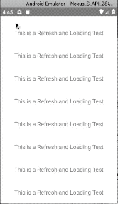
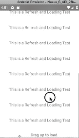

<!--
 * @Author: 石破天惊
 * @email: shanshang130@gmail.com
 * @Date: 2021-07-29 18:09:43
 * @LastEditTime: 2021-07-29 18:48:05
 * @LastEditors: 石破天惊
 * @Description: 
-->
# Loading

### Preview


### Code

Import

```$js
import { LargeList } from "react-native-largelist";
import { NormalFooter } from "react-native-spring-scrollview/NormalFooter";
```

It is easy to support loading more data with LargeList. React-native-spring-scrollview offers a `NormalFooter` for you. And you can try other loading footers in the [Customize](https://github.com/bolan9999/react-native-spring-scrollview/tree/master/src/Customize) dir.

**Precautions:** If you want to use `CommonLottieHeader` or `CommonLottieFooter`, you must install `lottie-react-native` by yourself. If you want to use the Header of Footer with date, you must install `@react-native-async-storage/async-storage` by yourself. If you `import from react-native-spring-scrollview/Customize`, they two bitches are required.

```$js
<LargeList
  ref={ref => (this._list = ref)}
  loadingFooter={NormalFooter}
  allLoaded={this.state.allLoaded}
  onLoading={()=>{
    setTimeOut(()=>{
      this._list.endLoading();
      this.setState({...});
    },2000);
  }
  //...
/>
```


### Props

Props  |  Type  |  Default  |  Description  
---- | ------ | --------- | --------
onLoading | ()=>any | undefined | The callback of loading. If set this prop, a loading footer will add to the botom of the LargeList
allLoaded | boolean | false | Whether the data is all loaded.
loadingFooter | LoadingFooter | NormalFooter | The footer component of loading. If you want to customize loading footer , this will be helpful [Custom Loading](/en/V3/Loging#Customize\ loading)

### All loading footers in this library

```
import {NormalFooter} from "react-native-spring-scrollview/NormalFooter";
import {
    CommonLottieFooter,
    WithLastDateFooter,
    ChineseNormalFooter,
    ChineseWithLastDateFooter,
} from "react-native-spring-scrollview/Customize";
```


# Customize loading

在我们自定义上拉加载之前， 我们需要先了解一个上拉加载各个状态：

Understand the refreshing status before customizing refreshing:

* "waiting": The content view is not out of the bottom yet.
* "dragging": The content view is out of the bottom but not too more to load.
* "draggingEnough": It is enough to load,but the finger has not touched up, and will load more data at once if touching up.
* "draggingCancel": Drag back after the `draggingEnough` status.
* "loading": Loading data.
* "rebound": The loading has been completed and it is rebounding.
* "allLoaded": Whether the data is all loaded.

### Customize

#### Import
```$js
import { LoadingFooter } from "react-native-spring-scrollview/LoadingFooter";
```

#### Extends `LoadingFooter`
```$js
class MyFooter extends LoadingFooter{}
```

#### Overwrite `render`
```$js
render() {
  return <Text>{this.state.status}</Text>
}
```

LoadingFooter has these props and states extended from its parent. You can use it directly.
* this.props.maxHeight: The type is `number`， it is the height for the loading footer.
* this.props.offset: The type is `Animated.Value`, Animated value for contentOffset.y of the SpringScrollView
* this.state.status: The type is `FooterStatus`, it is the status of the loading footer.
```$js
export type FooterStatus =
  | "waiting"
  | "dragging"
  | "draggingEnough"
  | "draggingCancel"
  | "releaseRebound"
  | "loading"
  | "rebound"
  | "allLoaded";
```

#### Customize the height of the loading footer
Overwrite the static var `height` to change the height of the loading footer.
```$js
class MyFooter extends LoadingFooter{
    static height:number = 50;
}
```

#### Select the loading style

Overwrite the static var `style` to change the style of the loading footer.
```
class MyFooter extends LoadingFooter{
    static style:string = "stickyContent";
}
```

LargeList supports 3 kinds of style for loading footer,default is `stickyContent` ：

style  |  preview
---- | ------
"bottoming" | 
"stickyScrollView" | 
"stickyContent" | 

#### Apply your customize loading footer toLargeList
```$js
<LargeList loadingFooter={MyFooter}/>
```

Fully example is here [NormalFooter](https://github.com/bolan9999/react-native-spring-scrollview/blob/master/src/LoadingFooter.js)

#### Native interpolate animation

this.props.offset: Native driver animated value for contentOffset.y of the LargeList, you can use it to make a native animation.

Example:

```$js
<Animated.Image
    source={require("./Customize/res/arrow.png")}
    style={{
    transform: [{
        rotate: offset.interpolate({
            inputRange: [
                bottomOffset - 1 + 45,
                bottomOffset + 45,
                bottomOffset + maxHeight,
                bottomOffset + maxHeight + 1
            ],
            outputRange: ["180deg", "180deg", "0deg", "0deg"]
        })
    }]
}}/>
```

Fully example is here [NormalFooter](https://github.com/bolan9999/react-native-spring-scrollview/blob/master/src/NormalFooter.js)

#### Lottie animation support

```
export class CommonLottieFooter extends RefreshHeader {
  static height: number = 100;

  render() {
    if (this.state.status === "allLoaded") return null;
    const { offset, bottomOffset } = this.props;
    let progress = offset.interpolate({
      inputRange: [
        bottomOffset + 50,
        bottomOffset + 500
      ],
      outputRange: [0, 1]
    });
    if (this.state.status === "loading") {
      progress = undefined;
    }
    return (
      <View style={{ flex: 1, marginBottom: 20 }}>
        <LottieView
          key={this.state.status === "loading"}
          source={require("./res/loading.json")}
          progress={progress}
          autoPlay={this.state.status === "loading"}
          loop={this.state.status === "loading"}
          speed={2}
        />
      </View>
    );
  }
}
```
Full lottie animation example is here [CommonLottieFooter](https://github.com/bolan9999/react-native-spring-scrollview/blob/master/src/Customize/CommonLottieFooter.js)

### Contribute your awesome loading footer

Fork [react-native-spring-scrollview](https://github.com/bolan9999/react-native-spring-scrollview), make awesome loading footer in the [Customize](https://github.com/bolan9999/react-native-spring-scrollview/tree/master/src/Customize) dir, and pull a request to me.
