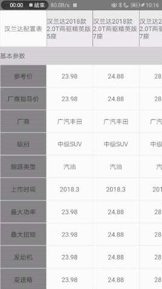

# Overview
StickyForm is a form that support sticky header, section on the top. And it will also sticky the first element of `renderHeader`,`renderSection`,`renderIndexPath`,`renderFooter` element on the left of the StickyForm.

### 预览

