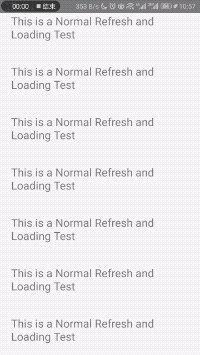

# 上拉加载

### 预览



### 代码

导入

```$js
import { LargeList } from "react-native-largelist-v2";
import { NormalFooter } from "react-native-spring-scrollview/NormalFooter";
```

使用LargeList可以非常简单地实现上拉加载的功能, 本库默认提供了一个NormalFooter类供用户使用

```$js
<LargeList
  ref={ref => (this._scrollView = ref)}
  style={styles.container}
  loadingFooterHeight={60}
  loadingFooter={NormalFooter}
  allLoaded={false}
  onLoading={()=>{
    this._scrollView.beginLoading();
    setTimeOut(()=>{
      this._scrollView.endLoading();
      setTimeOut(()=>this.setState({prop:"your changed props"}));
    },2000);
  }
  onCancelLoading={()=>{
    console.log("当上拉加载，但是用户主动回拉取消时回调");
  }
  />
```


### 属性

#### loadingFooterHeight

类型：number

默认值： 80

描述：上拉加载组件的高度

#### loadingFooter

类型：LoadingFooter

默认值： undefined

描述：上拉加载组件，用户如果不希望自定义，则可以使用NormalFooter,如果需要高度自定义，请参看[自定义上拉加载](CustomLoading)

#### onLoading

类型：()=>any

默认值：()=>null

描述：上拉加载的回调函数

#### onCancelLoading

类型：()=>any

默认值：()=>null

描述：触发上拉加载回调以后，在加载的过程中，用户可以回拉取消加载，如果你希望在此回调，则可以在此做您的操作。

### allLoaded

类型：boolean

默认值： false

描述：数据是否加载完成。

### 方法

#### beginLoading()

开始加载，弹出（或回弹）加载组件

### endLoading(rebound: boolean = false)

结束加载，rebound表示是否需要回弹关闭加载组件，如果你的数据是增加了，那么这个属性就可以使用默认的。 在onLoading完成数据请求以后，我们建议您先使用此方法开启结束动画，再setTimeout更新内容，这样在加载过程中，动画更流畅

