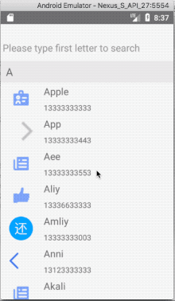
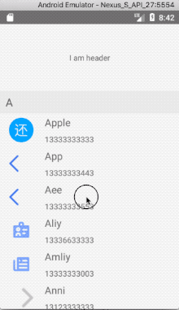

# react-native-largelist

**React-native-largelist** is a high performance large list component for React-Native. (iOS & Android) Now V2 is available. V1 is [here](https://github.com/bolan9999/react-native-largelist/tree/V1)

## Features

* Large data source list component, items reused by group, Less CPU/Memory usage.
* Fully Cross-platform bounces (iOS & Android).
* Customize Refreshing and Loading.
* Header and Footer support.
* ScrollToIndex support.
* Sticky Section support.
* No blanks(theoretically speaking).

## Preview

## License

react-native-largelist is released under the MIT license. See LICENSE for details.

