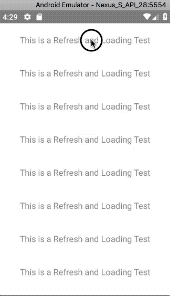
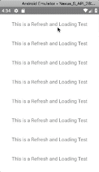
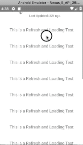

<!--
 * @Author: 石破天惊
 * @email: shanshang130@gmail.com
 * @Date: 2021-07-21 13:11:34
 * @LastEditTime: 2021-07-28 17:00:32
 * @LastEditors: 石破天惊
 * @Description: 
-->
# 下拉刷新

### 预览


### 导入

```$js
import { LargeList } from "react-native-largelist";
import { ChineseWithLastDateHeader } from "react-native-spring-scrollview/Customize";
```

使用LargeList可以非常简单地实现下拉刷新的功能, `react-native-spring-scrollview`默认提供了一个NormalHeader类供用户使用(在[Customize](https://github.com/bolan9999/react-native-spring-scrollview/tree/master/src/Customize)目录下有提供其他比较常用的下拉刷新组件),中文用户推荐使用ChineseWithLastDateHeader

请注意，`CommonLottieHeadr`和`CommonLottieFooter`都使用了`lottie-react-native`,带有日期的组件都使用了`@react-native-async-storage/async-storage`.如果你需要使用，那么请自行安装。


### 简单示例

```$js
<LargeList
  ref={ref => (this._list = ref)}
  refreshHeader={ChineseWithLastDateHeader}
  onRefresh={()=>{
    setTimeOut(()=>{
      this._list.endRefresh();
      setTimeOut(()=>this.setState({prop:"your changed props"}));
    },2000);
  }
  //...other props
/>
```

属性  |  类型  |  默认值  |  作用  
---- | ------ | --------- | --------
onRefresh | ()=>any | undefined | 下拉刷新的回调函数,如果设置了此属性，则会在顶部加一个刷新Header
refreshHeader | [RefreshHeader](https://github.com/bolan9999/react-native-spring-scrollview/blob/master/src/RefreshHeader.js) | NormalHeader | 选择下拉刷新的组件，用户如果不希望高度自定义，则可以不设定直接使用NormalHeader,如果需要高度自定义，请参看[自定义下拉刷新](zh-cn/V3/CustomRefresh)


**请注意，V2版本取消了refreshHeaderHeight属性，想要自定义刷新组件的高度，请查看[自定义下拉刷新](zh-cn/V3/CustomRefresh)下的[自定义高度](zh-cn/V3/CustomRefresh?id=自定义刷新组件的高度)**


### 方法

### beginRefresh()

主动启动刷新组件开始刷新。

### endRefresh()

结束刷新，关闭刷新组件。 在onRefresh完成数据请求以后，我们建议您先使用此方法开启结束动画，再更新内容，这样在下拉过程中，动画更流畅（ **注意：V2版本已经取消了beginRefresh过程，组件会自动开始刷新** ）

### 本库提供的额外刷新控件

react-native-spring-scrollview提供了一些刷新控件, 用户可以试试
```
import { NormalHeader } from "react-native-spring-scrollview/NormalHeader";
import {
    CommonLottieHeadr,
    WithLastDateHeader,
    ChineseNormalHeader,
    ChineseWithLastDateHeader,
} from "react-native-spring-scrollview/Customize";
```


# 自定义下拉刷新

在我们自定义下拉刷新之前， 我们需要先了解一个下拉刷新各个状态：

* "waiting": 准备状态：视图还没有碰边
* "pulling": 下拉状态：视图已经碰到边缘，但是还没有达到组件的高度，此时松手不具备刷新的条件
* "pullingEnough": 下拉足够态：视图已经达到组件的高度，但是用户还没有松手，松手即可进入刷新态
* "pullingCancel": 下拉取消态: 当用户下拉经历过下拉足够态，但是又往上拉，达不到刷新的高度，则进入此状态，如果用户不松手，重新下拉可再次进入下拉足够态
* "refreshing": 刷新态：已经触发onRefresh，此时正在刷新中
* "rebound": 回弹态: 已经刷新完成，正在往回弹的状态

### 自定义

#### 导入
```$js
import { RefreshHeader } from "react-native-spring-scrollview/RefreshHeader";
```

#### 继承RefreshHeader
```$js
class MyHeader extends RefreshHeader{}
```

#### 重写render
```$js
render() {
  return <Text>{this.state.status}</Text>
}
```

RefreshHeader自带有两个Props, 和一个状态status，在子类里面可以直接使用

* this.props.maxHeight,类型是number， 表示刷新组件的高度
* this.props.offset，类型是Animated.Value 表示当前LargeList的contentOffset.y（原生动画值）
* this.state.status，类型是HeaderStatus: 表示当前刷新组件正处在的状态
```$js
export type HeaderStatus =
  | "waiting"
  | "pulling"
  | "pullingEnough"
  | "pullingCancel"
  | "refreshing"
  | "rebound";
```

#### 自定义刷新组件的高度

只需要重写静态变量height就可以改变该刷新组件的高度（**请注意这与V1有差别，V2取消了refreshHeaderHeight属性，V2更加注重刷新组件的独立性**）:
```
class MyHeader extends RefreshHeader{
    static height:number = 50;
}
```

#### 选择刷新组件的下拉样式

只需要重写静态变量style就可以改变刷新组件的样式,默认值是"stickyContent"：
```
class MyHeader extends RefreshHeader{
    static style:string = "stickyContent";
}
```

LargeList目前支持三种样式：

style  |  效果
---- | ------
"topping" | 
"stickyScrollView" | 
"stickyContent" | 

#### 将自定义的刷新组件应用到LargeList
```$js
<LargeList refreshHeader={MyHeader}/>
```

完整的示例可以查看[NormalHeader](https://github.com/bolan9999/react-native-spring-scrollview/blob/master/src/NormalHeader.js)

### 性能优化

#### 避免无用的状态改变带来的无用更新
你可以通过重写onStateChange(oldStatus: HeaderStatus, newStatus: HeaderStatus)来阻止不需要的状态更新带来的re-render

举个例子，如果你只需要区分正在刷新和没有刷新两种状态，那么你可以像下面这样优化它
```$js
onStateChange(oldStatus: HeaderStatus, newStatus: HeaderStatus) {
  if (oldStatus === "refreshing" || newStatus==="refreshing") {
    this.setState({status:newStatus});
  }
}
```

除此之外，刷新控件应当设计得足够简单（DOM节点数量不能太多，太多会造成卡顿）

#### 渐变动画

this.props.offset: 表示当前LargeList的contentOffset.y的原生动画值，， 你可以使用这个值来自定义你的动画：

举个例子，如果你有个箭头图标，希望在下拉过程中旋转角度，当到达刷新状态的时候，完全反转角度，那么你可以这样写

```$js
<Animated.Image
    source={require("./Customize/res/arrow.png")}
    style={{
    transform: [{
        rotate: offset.interpolate({
            inputRange: [-maxHeight - 1 - 10, -maxHeight - 10, -50, -49],
            outputRange: ["180deg", "180deg", "0deg", "0deg"]
        })
    }]
}}/>
```

完整的示例可以查看[NormalHeader](https://github.com/bolan9999/react-native-spring-scrollview/blob/master/src/NormalHeader.js)

#### lottie动画支持

示例：
```
export class CommonLottieHeader extends RefreshHeader {
  static height: number = 100;

  render() {
    let progress = this.props.offset.interpolate({
      inputRange: [-200, -150, -150, -100, -100, -50],
      outputRange: [1, 0, 1, 0, 1, 0]
    });
    if (this.state.status === "refreshing") {
      progress = undefined;
    }
    return (
      <View style={{ flex: 1, marginTop: 20 }}>
        <LottieView
          source={
            this.state.status === "refreshing" ? require("./res/refreshing2.json") : require("./res/refreshing.json")
          }
          progress={progress}
          autoPlay={this.state.status === "refreshing"}
          loop={this.state.status === "refreshing"}
        />
      </View>
    );
  }
}
```

完整示例可查看这里[CommonLottieHeader](https://github.com/bolan9999/react-native-spring-scrollview/blob/master/src/Customize/CommonLottieHeader.js)

### 贡献您的自定义下拉刷新组件

欢迎Fork react-native-spring-scrollview ，添加您精心制作的RefreshHeader， 提交Pull Request 合并到master，给其他人使用。

